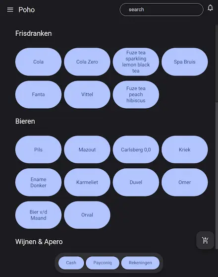
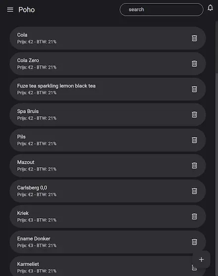
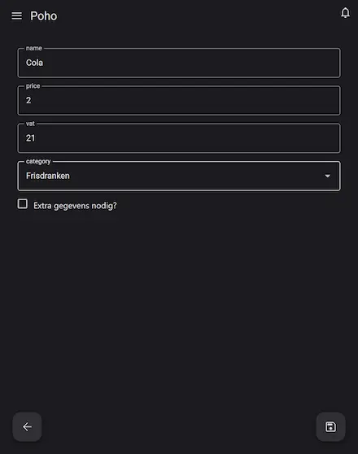

# PoHo

> cash register app

## screenshots
### sales


### products


### product-edit


## development

### watch

```sh
npm run watch
```

### build

```sh
npm run build
```

### serve

```sh
npm run serve
```

## powered by

- [lit](https://lit.dev)
- [material-web](https://material-web.dev/)
- [lit-elements](https://github.com/VandeurenGlenn/custom-elements/tree/main/packages/lit-elements)
- [rollup-plugin-material-symbols](https://github.com/vandeurenglenn/rollup-plugin-material-symbols)
